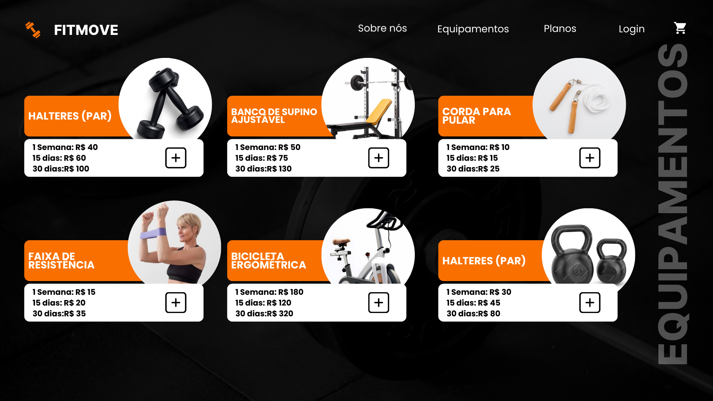
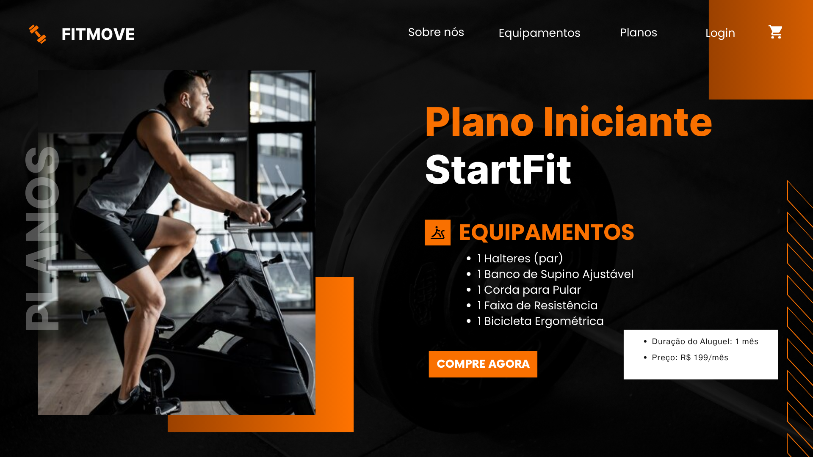
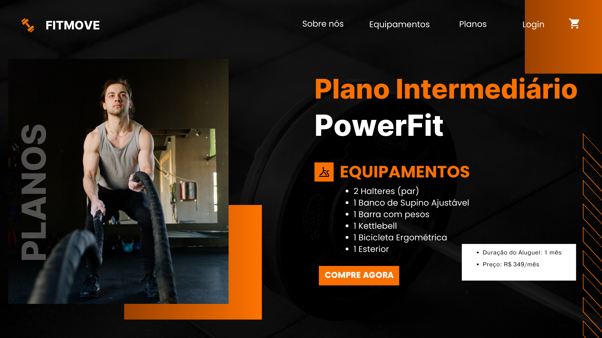
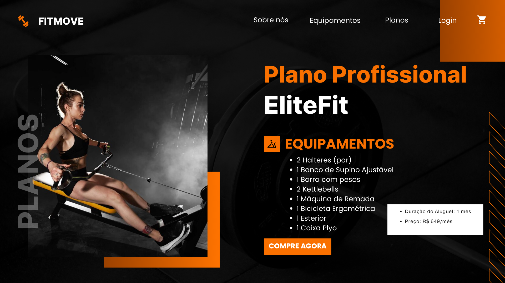
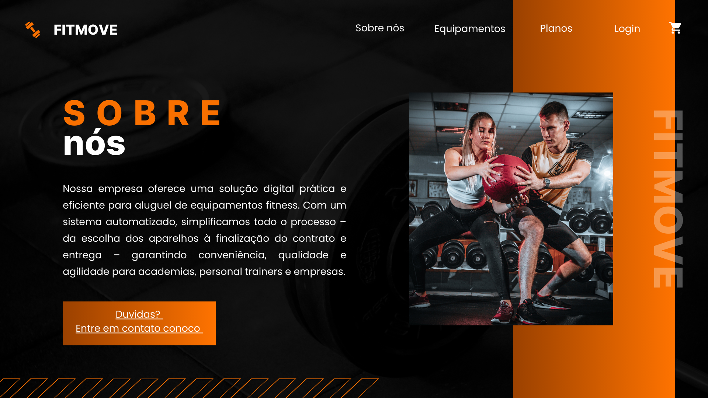
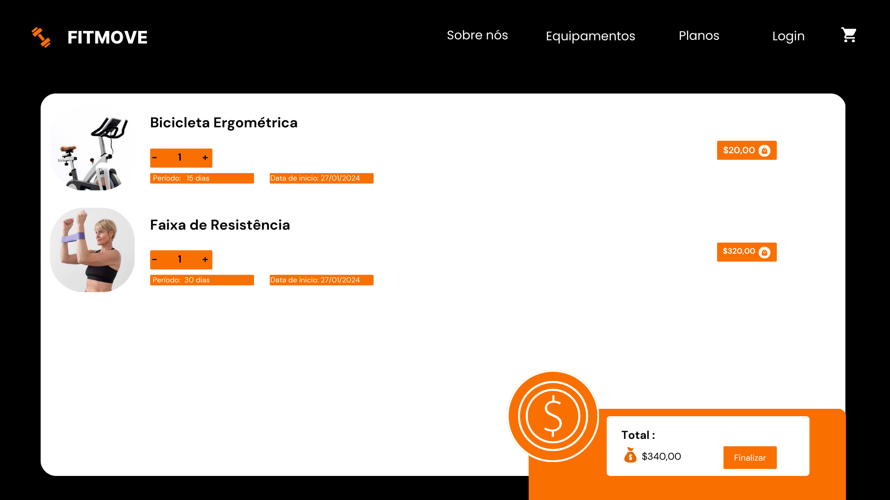
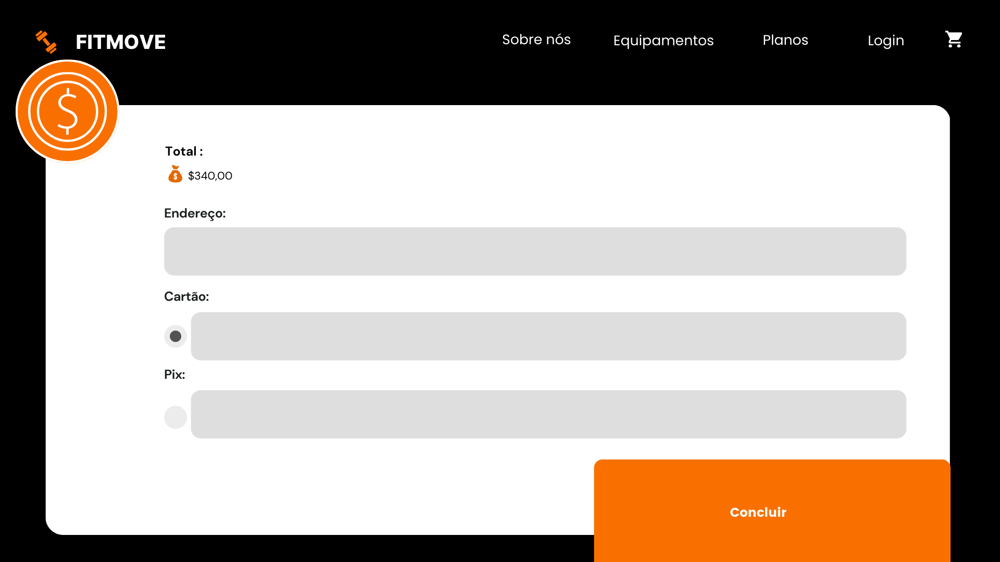
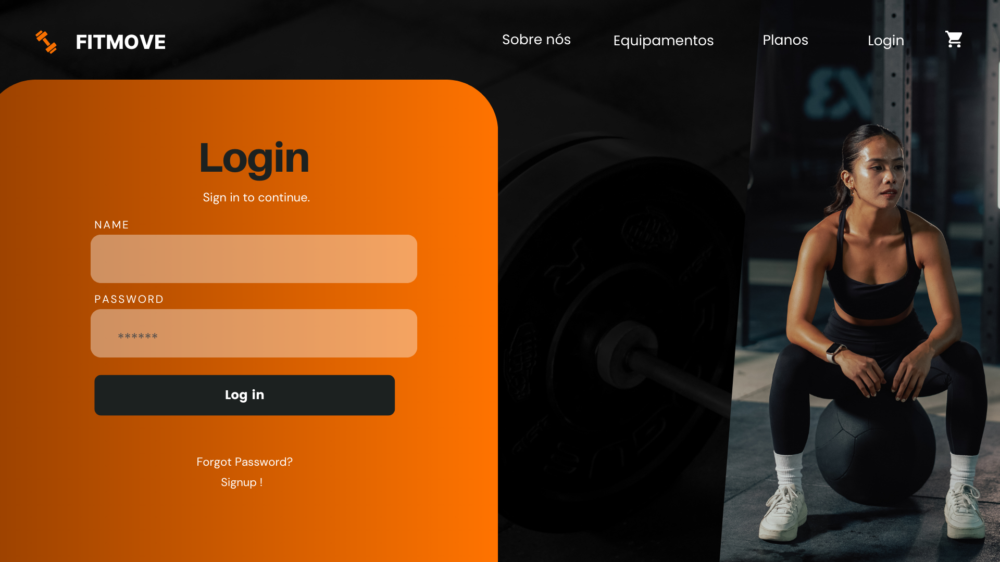
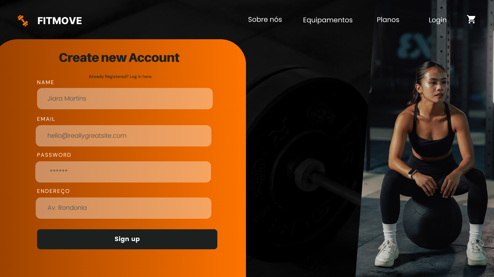

# **Trabalho Final - Sistema Web I**

## *Discente: Mariana Vieira*

<!-- Descrever um resumo sobre o trabalho. -->

## **Resumo**

Este trabalho propõe o desenvolvimento de um sistema para o aluguel de aparelhos de musculação, direcionado a academias, personal trainers e empresas que oferecem locação de equipamentos para clientes diversos, incluindo academias caseiras, eventos fitness e espaços temporários. O sistema proporcionará uma experiência eficiente e automatizada, permitindo que os usuários escolham entre planos de aluguel ou opções individuais de equipamentos. 

## **1. Tema**

O projeto se concentra no desenvolvimento de um sistema digital para gestão de aluguel de equipamentos fitness, oferecendo praticidade e automação desde a seleção dos aparelhos até a entrega.

## **2. Escopo**

### As principais funcionalidades do sistema incluem:

* Catálogo de Equipamentos e Planos;

* Aluguel individual para personalização da seleção de equipamentos;

### Disponibilidade de planos pré-configurados por:

* Tipo de treino;

* Quantidade de equipamentos;

* Duração do aluguel;

### Carrinho de Aluguel:

* Adição e remoção de equipamentos e planos;

* Resumo detalhado do pedido.

### Cadastro e Login de Usuário:

* Registro com dados do usuário;

* Login para usuários;

### Meios de Pagamento:

* Opções de pagamento.


## 3. Restrições

* Equipamentos e Meios de Pagamento: O sistema será limitado a um número reduzido de equipamentos e métodos de pagamento (cartões de crédito/débito e transferências bancárias).

* Personalização de Planos: Apenas opções predeterminadas de planos estarão disponíveis.

* Plataformas: O sistema será desenvolvido como uma aplicação web, sem versão para dispositivos móveis.

* Entrega: A logística de entrega não será gerida pelo sistema.

* Cadastro de Equipamentos: Apenas administradores poderão cadastrar novos equipamento

## 4. Protótipo

 Os protótipos das principais telas do sistema foram desenvolvidos:

1- Página inicial, apresentação dos planos, equipamentos e informações sobre a empresa;

<p align="center">
  
  
  
  
  
  
</p>

2- Carrinho de aluguel e pagamento;

<p align="center">
 
 
</p>

4- Cadastro e login de usuário;

<p align="center">
 
 
</p>

# FitMove - Guia de Instalação

A FitMove é composta por um **frontend** desenvolvido em **React/Next.js** e um **backend** baseado em **Spring Boot**. O código-fonte da aplicação pode ser acessado no GitHub:  
[FitMove - GitHub](https://github.com/SamuellAguiar/Trab_Engenharia_Sof_II).

## Pré-requisitos

Antes de iniciar a instalação, certifique-se de ter os seguintes requisitos instalados:

- **Node.js** (v16 ou superior)
- **Java** (JDK 17 ou superior)
- **Maven** (para compilar o projeto Spring Boot)
- **MySQL** (v8.0 ou superior)

## Configurar o Banco de Dados

1. Certifique-se de que o MySQL está instalado e em execução.
2. Crie um banco de dados chamado `fitmovedb` (opcional, pois a aplicação pode criá-lo automaticamente).
3. Verifique se as credenciais no arquivo `application.properties` correspondem às suas configurações:

```properties
spring.datasource.username=root
spring.datasource.password=root
```

## Executar o Backend (Spring Boot)

1. Navegue até a pasta raiz do projeto backend.
2. Execute o seguinte comando para compilar e iniciar o servidor:

```sh
mvn spring-boot:run
```

3. O servidor será iniciado na porta **8080**.

## Configurar e Executar o Frontend (Next.js)

1. Navegue até a pasta raiz do projeto frontend.
2. Instale as dependências:

```sh
npm install
```

3. Configure a variável de ambiente para apontar para o backend:
    - Crie um arquivo `.env.local` na raiz do projeto com o seguinte conteúdo:

```sh
NEXT_PUBLIC_API_URL=http://localhost:8080
```

4. Inicie o servidor de desenvolvimento:

```sh
npm run dev
```

5. O frontend estará disponível em [http://localhost:3000](http://localhost:3000).

Agora você deve ter a aplicação **FitMove** rodando com o frontend e backend integrados! 🚀
