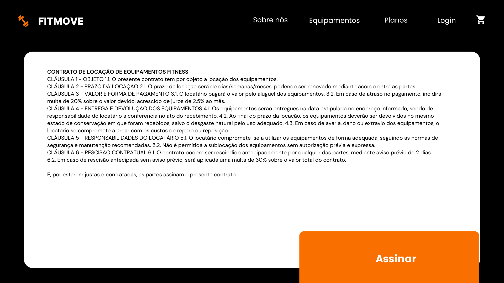

# **CSI606-2024-02 - Remoto - Proposta de Trabalho Final**

## *Discente: Mariana Vieira*

<!-- Descrever um resumo sobre o trabalho. -->

## **Resumo**

Este trabalho propõe o desenvolvimento de um sistema para o aluguel de aparelhos de musculação, direcionado a academias, personal trainers e empresas que oferecem locação de equipamentos para clientes diversos, incluindo academias caseiras, eventos fitness e espaços temporários. O sistema proporcionará uma experiência eficiente e automatizada, permitindo que os usuários escolham entre planos de aluguel ou opções individuais de equipamentos. 

## **1. Tema**

O projeto se concentra no desenvolvimento de um sistema digital para gestão de aluguel de equipamentos fitness, oferecendo praticidade e automação desde a seleção dos aparelhos até a finalização do contrato e entrega.

## **2. Escopo**

### As principais funcionalidades do sistema incluem:

* Catálogo de Equipamentos e Planos;

* Aluguel individual para personalização da seleção de equipamentos;

### Disponibilidade de planos pré-configurados por:

* Tipo de treino;

* Quantidade de equipamentos;

* Duração do aluguel;

### Carrinho de Aluguel:

* Adição e remoção de equipamentos e planos;

* Resumo detalhado do pedido.

### Cadastro e Login de Usuário:

* Registro com nome, CPF, endereço, telefone e e-mail;

* Login para usuários recorrentes;

* Histórico de pedidos e gestão de contratos.

### Meios de Pagamento:

* Suporte a múltiplos métodos de pagamento.

### Assinatura Digital de Contrato:

* Geração automática de contratos personalizados com base no pedido.

## 3. Restrições

* Equipamentos e Meios de Pagamento: O sistema será limitado a um número reduzido de equipamentos e métodos de pagamento (cartões de crédito/débito e transferências bancárias).

* Personalização de Planos: Apenas opções predeterminadas de planos estarão disponíveis.

* Plataformas: O sistema será desenvolvido como uma aplicação web, sem versão para dispositivos móveis.

* Entrega: A logística de entrega não será gerida pelo sistema.

* Cadastro de Equipamentos: Apenas administradores poderão cadastrar novos equipamento

## 4. Protótipo

 Os protótipos das principais telas do sistema foram desenvolvidos:

1- Página inicial, apresentação dos planos, equipamentos e informações sobre a empresa;

  
  
  
  
  
  

2- Carrinho de aluguel e pagamento;

 
 

4- Cadastro e login de usuário;

 
 

5- Página de assinatura do contrato e finalização do aluguel.

 
 

